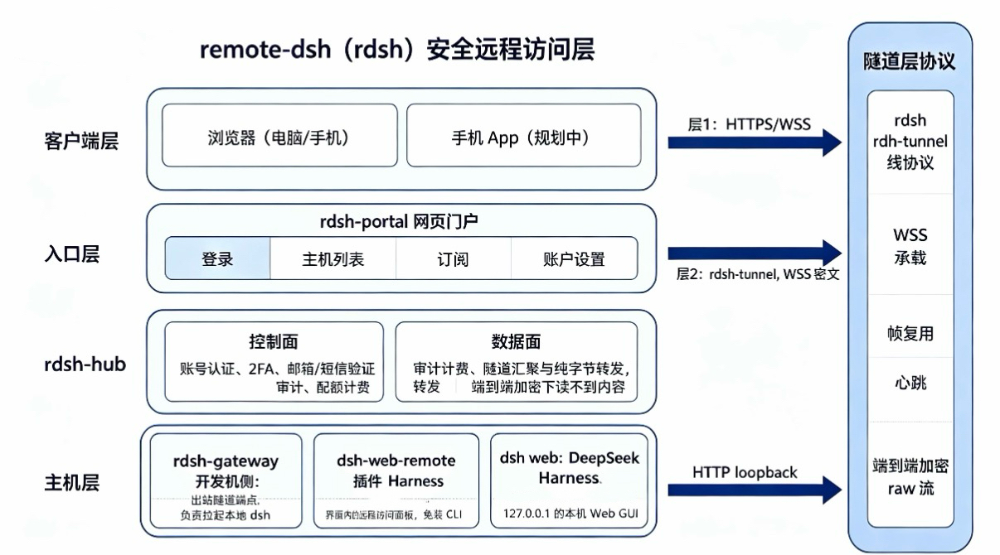

# remote-dsh

**English** | [中文](README.zh.md)

**remote-dsh turns your DeepSeek Harness (DSH) into an AI agent you can use from any browser — no public IP, no client install.**


## Why remote-dsh

- **Browser-first**: no public IP, no client install — open a browser and drive your agent;
- **Two access paths**: the DSH plugin (`dsh-web-remote`) for one-click setup, or the CLI (`remote-dsh`) for full control;
- **Open & auditable**: MIT-licensed, frozen protocol (the gateway never needs changes) — self-host it or embed it.

## Use cases

### ① Get started fast (rdsh Hub cloud relay)
- **For**: most users who want the fastest path — no self-hosted hub, no public IP; just install the DSH plugin on your machine;
- **Needs**: an rdsh account + the `dsh-web-remote` DSH plugin;
- **Result**: access from anywhere (laptop / phone / in-WeChat browser) by signing in.

```bash
dsh plugin add dsh-web-remote   # install the plugin in DSH, paste hub URL + join token in the panel
# or via the CLI:
npm install -g remote-dsh
rdsh host join <hub-url>        # outbound tunnel to the hub
```

### ② Direct connection (no hub)
- **LAN**: on the same network, `rdsh host serve` then connect by IP after pairing;
- **Cloud server**: a host with a public IP/domain, `rdsh host serve` + TLS password auth, connect by IP/domain;
- **For**: technical users who want full control and no third-party hub.

```bash
npm install -g remote-dsh
rdsh host setup lan             # or setup cloud (needs --tls-cert/--tls-key)
rdsh host serve                 # run it (spawns dsh web)
# open http://<ip>:<port> in a browser on the same network, enter the pairing code
```

### ③ Self-hosted (self-hosted hub · full control)
- **Self-hosted hub**: run `rdsh hub serve` on your own machine or cloud host, with multi-user / audit / sharing;
- **For**: teams / enterprises that want unified accounts, audit, and data ownership.

```bash
npm install -g remote-dsh
rdsh hub serve                  # self-host the hub (built-in TLS or behind a reverse proxy)
# members join via ① (plugin) or `rdsh host join <your-hub>`
```

## Architecture



```
        Client (browser / app / weapp)
                    │
                    │  HTTPS/WSS — layer 1: hub public API
                    ▼
                rdsh-hub
                    │
                    │  WSS tunnel — layer 2: rdsh-tunnel
                    ▼
             rdsh-gateway
                    │
                    │  HTTP (loopback)
                    ▼
          dsh web (127.0.0.1)
```

Two protocol layers: **layer 1** (hub public API, JSON over HTTPS + WSS events)
is the only contract clients implement; **layer 2** (`rdsh-tunnel`) runs between
hub and gateway only — clients never implement it.

## Components

| Component | Name | Role |
|---|---|---|
| CLI | `rdsh` | `rdsh host serve` (LAN) / `rdsh host join <hub>` (public) / `rdsh hub ...` |
| Server | rdsh-hub | control plane (auth, host registry, routing) + data plane (tunnel relay) |
| Host agent | rdsh-gateway | LAN auth gateway / outbound tunnel endpoint; spawns `dsh web` |
| Tunnel protocol | rdsh-tunnel | wire protocol: framing, multiplexing, heartbeat |
| Portal | rdsh-portal | web login + host list (Vite + React) |
| DSH plugin | dsh-web-remote | remote-access panel inside the DSH UI (no CLI) |
| Mobile app | rdsh-app | Flutter (Android/iOS) |
| WeChat mini program | rdsh-weapp | lightweight client |

## Capabilities & status

**Current status**: M1–M5 implemented and verified; **end-to-end encryption
(E2EE) is complete** (community + SaaS). See [features.md](doc/overview/features.md)
for the full feature list; [roadmap](doc/overview/roadmap.md) for milestones.

**Core capabilities**:
- **Three access modes**: LAN direct / cloud-server direct (TLS + password) / public hub relay (outbound tunnel)
- **End-to-end encryption**: the hub relays your DSH traffic but cannot read the content (prompts / code / files / API keys stay encrypted) — Noise NK handshake (X25519 + AES-256-GCM), fresh session keys per connection, browser TOFU fingerprint trust, pin stored locally only
- **Multi-tenant & security**: email verification + 2FA, host sharing (owner/member), audit log, login rate-limiting (lockout + throttling), IP allow-list
- **Two access paths**: the `dsh-web-remote` plugin (no CLI) or the `remote-dsh` CLI; `rdsh hub` runs with built-in TLS or behind a reverse proxy

**Planned**: SaaS managed hub, mobile apps (Android/iOS), WeChat mini program.

## Blog

Scenario guides, from simple to complex — full index: [English](doc/blog/README.md) · [中文](doc/blog/README.zh.md)

- [Control your DSH from any device on the same LAN (pair code)](doc/blog/en/01-01-lan-access.md)
- [Put your DSH on a cloud server: HTTPS + password (own cert)](doc/blog/en/02-01-cloud-single-tls.md)
- [No public IP? Relay through a hub — add a host with a join token (recommended)](doc/blog/en/03-04-join-token.md)
- [No CLI? Install a DSH plugin and get remote access right in the UI](doc/blog/en/03-05-plugin.md)
- [Run your own hub relay: hub + Apache2 (443 + auto-renewed certs)](doc/blog/en/03-02-hub-behind-apache-https.md)

## Development

- Node.js ≥ 22 (see `.nvmrc`), pnpm ≥ 9
- TypeScript monorepo (`packages/*`), Flutter app (`apps/app`), WeChat mini
  program (`apps/weapp`), future Go hub (`go/`)
- See [CONTRIBUTING.md](CONTRIBUTING.md) and the internal docs under `doc/`

## License

MIT — see [LICENSE](LICENSE). Brand assets (logo, name) are excluded — see [NOTICE](NOTICE).
